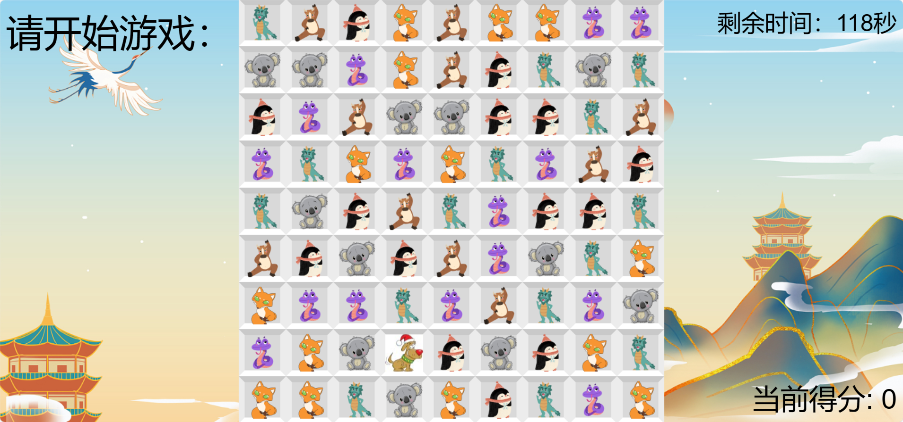
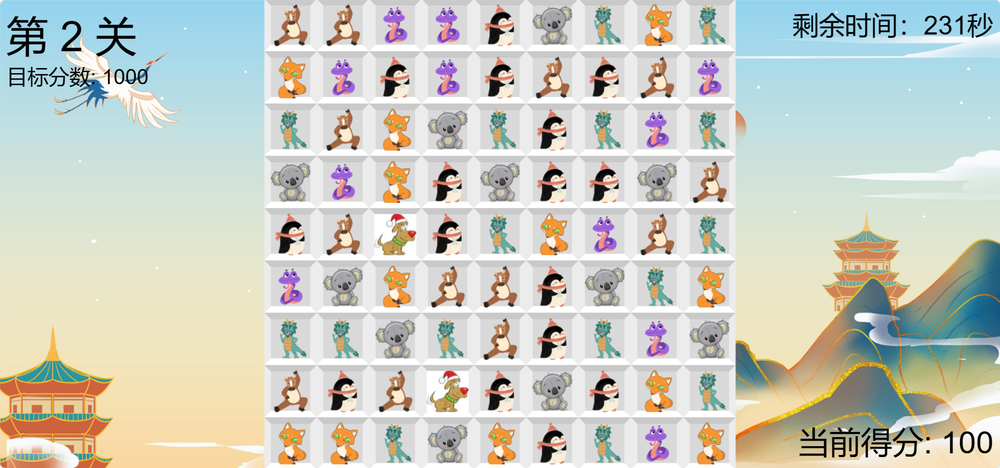
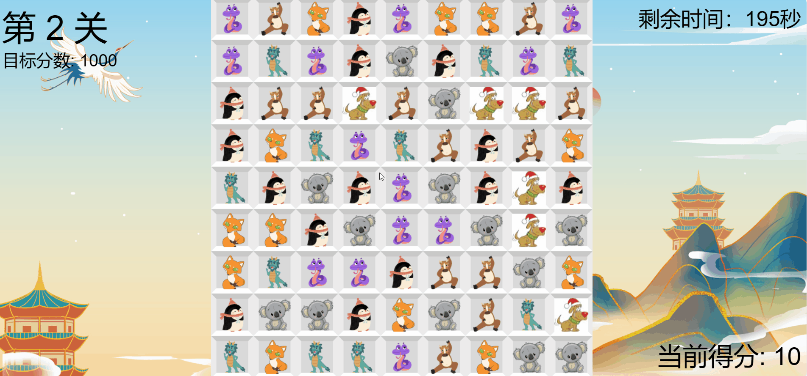

# 构建三消游戏

[TOC]

## 游戏设计

使用`PIXI.js`构建三消游戏，实现如下功能

- 本次项目构建的棋盘的大小为$9\times 9$；
- 实现基本功能：三个或三个以上相同的图块可以被消除，即从棋盘上移除，并落下随机产生的新图块填满棋盘；
- 增加评分功能：本次项目我设定每消除一个图块记$10$分；
- 增加关卡功能：每关的目标得分为$关卡数\times 500$，达到目标得分后进入下一关，初始记分$0$分，第二关开始每一关初始记分为$过关时刻分数 - 上一关目标得分$，即超出上一关目标分数的部分会被累计到下一关；
- 增加特殊宝石功能：棋盘中某个区域有$1\%$的概率会出现特殊图块，因为概率很小，所以大多数情况下是阻止其它图块连成直线。另外，如果三个或三个以上特殊图块相连，特殊图块被消除的同时它们所在的行和列的所有图块也会被消除，即特殊图块还能够帮助玩家快速过关
- 增加时间限制功能：随着关卡数增加，目标得分增加，时间限制也会响应调整，本项目设定每关的时间限制为$关卡数 \times 120秒$。如果超出时间未能达到目标分数，将会重新开始本关；

至此，本项目实现了要求的全部功能，具体的实现情况请见后文运行结果……

## 项目结构

```
.
├── README.md
├── assets
│   ├── ...
├── img
│   └── special.gif
├── index.html
├── node_modules
│   ├──...
├── package-lock.json
├── package.json
├── src
│   ├── game
│   │   ├── Board.js
│   │   ├── CombinationManager.js
│   │   ├── Config.js
│   │   ├── Field.js
│   │   ├── Game.js
│   │   └── Tile.js
│   ├── index.js
│   └── system
│       ├── App.js
│       └── Loader.js
└── webpack
    ├── base.js
    └── prod.js
```

## 游戏说明

进入程序目录中，执行`npm`

```shell
...\match3-game> npm start

> match3@1.0.0 start
> webpack-dev-server --config webpack/base.js --open

clean-webpack-plugin: options.output.path not defined. Plugin disabled...
<i> [webpack-dev-server] Project is running at:
<i> [webpack-dev-server] Loopback: http://localhost:8080/
...
webpack 5.88.2 compiled successfully in 2396 ms
```

出现上面输出的`localhost:8080`即为开始游戏，进入`localhost:8080`，出现下图界面，开始第一关的倒计时：



当用户开始操作界面，消除图块后，正式进入第一关，分数达到$关卡数\times 500$分后，进入下一关，以此类推……



游戏界面如图，左上角显示关卡数和本关目标的分，右上角显示剩余时间，右下角显示当前得分。

本次游戏共有$7$种图块，其中$6$种为普通图块，“白色背景，圣诞狗”为特殊图块（出现概率为$1\%$）

## 运行结果

游戏过程请观看目录下的[result.mp4](./result.mp4)文件。

由于特殊图块出现的概率极小，为展示其功能，我修改了他出现的概率用作功能测试，现已改回$1\%$，测试结果如下：


